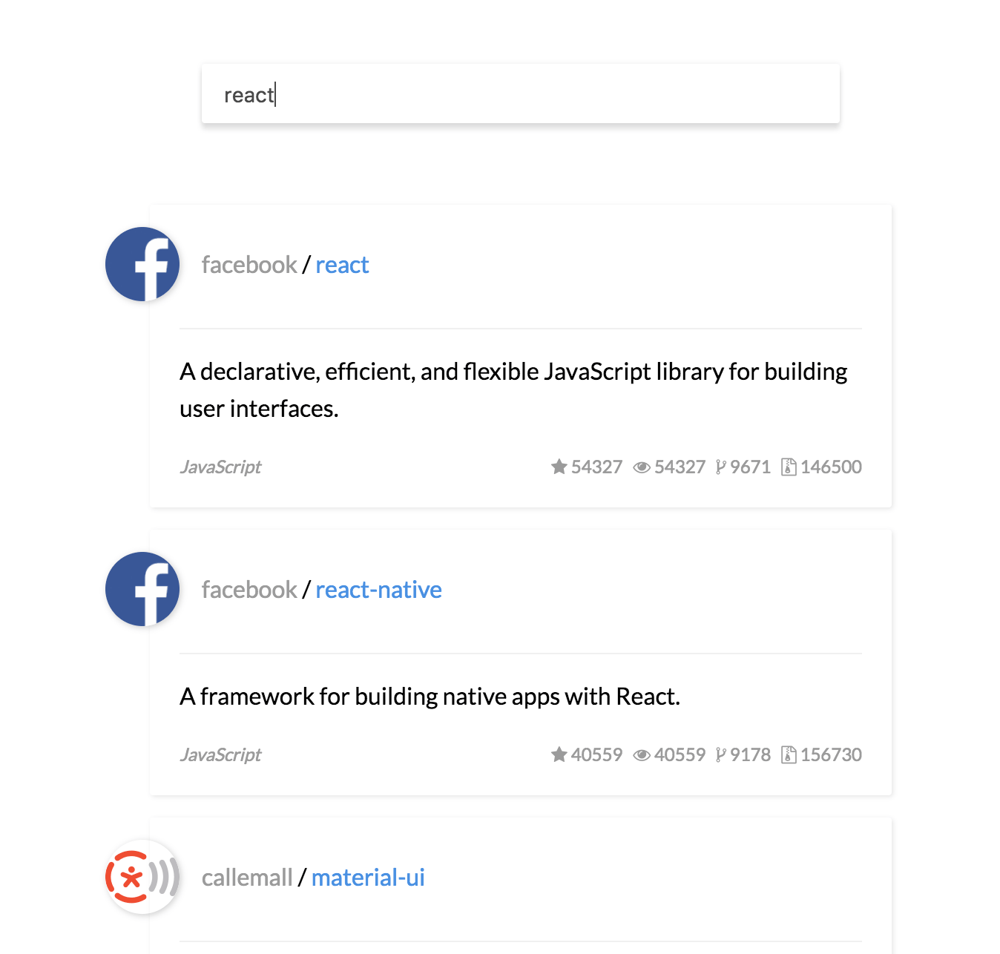
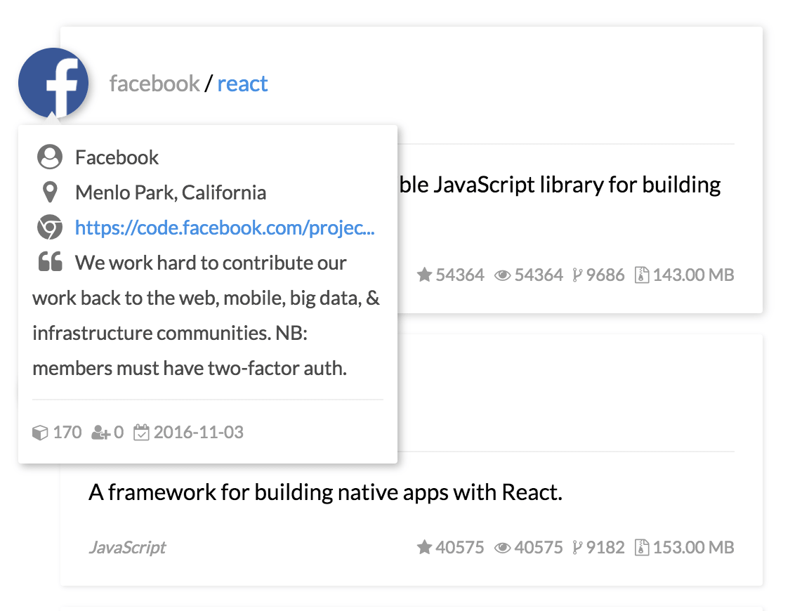

# rxjs-demo

通过构建一个简单的 github 应用，学习 RxJS 的快速入门教程。线上 DEMO 可戳 [https://dsh225.github.io/rxjs-demo](https://dsh225.github.io/rxjs-demo/)

## 开始前的准备

- 使用 ES6 语法
- 通过 webpack/webpack-dev-server 进行编译
## 本地跑起来

```bash
$ git clone https://github.com/dsh225/rxjs-demo.git
$ cd rxjs-demo
$ npm i
$ npm run dev-server
```

然后打开`http://localhost:8080/webpack-dev-server`即可

## 展示

- 通过`RxJS`，在输入过程中实时进行异步搜索：



- `hover`到 avator 上之后异步获取用户信息


